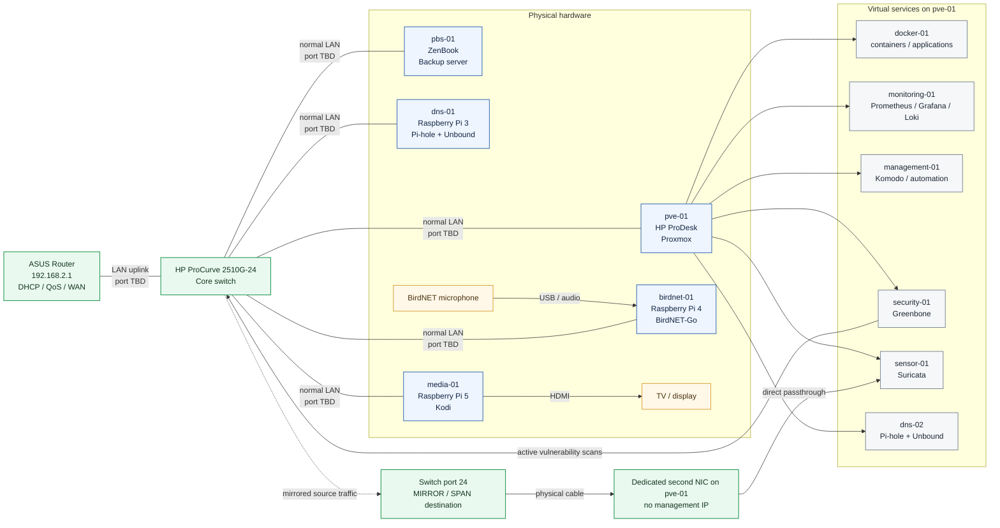

# Proposed Fresh-Start Homelab Layout

Status: working target design. Final host placement remains subject to completion of the network audit and Proxmox RAM/storage decisions.

## Confirmed switch-port information

- **Port 24** is the mirror/SPAN destination port.
- Port 24 will connect only to the dedicated capture NIC for `sensor-01`.
- Normal LAN port numbers remain unassigned until the current cabling/MAC table is audited.

See [HP ProCurve Port Map](../network/SWITCH-PORT-MAP.md).

## Router rebuild

The ASUS router will receive a clean firmware/factory-reset rebuild before the final DHCP and QoS configuration is established.

See [Router Clean-Rebuild Plan](../network/ROUTER-RESET-PLAN.md).

## Design intent

- Proxmox hosts the general virtual infrastructure.
- Greenbone runs in `security-01` and scans actively over the normal LAN.
- Suricata runs in `sensor-01` and receives switch-mirrored packets through a dedicated passthrough NIC.
- Kodi remains physical on the Raspberry Pi 5.
- BirdNET-Go remains physical on the Raspberry Pi 4 with the BirdNET microphone attached.
- Primary DNS remains physically independent on the Raspberry Pi 3.
- Backup remains physically independent from Proxmox.
