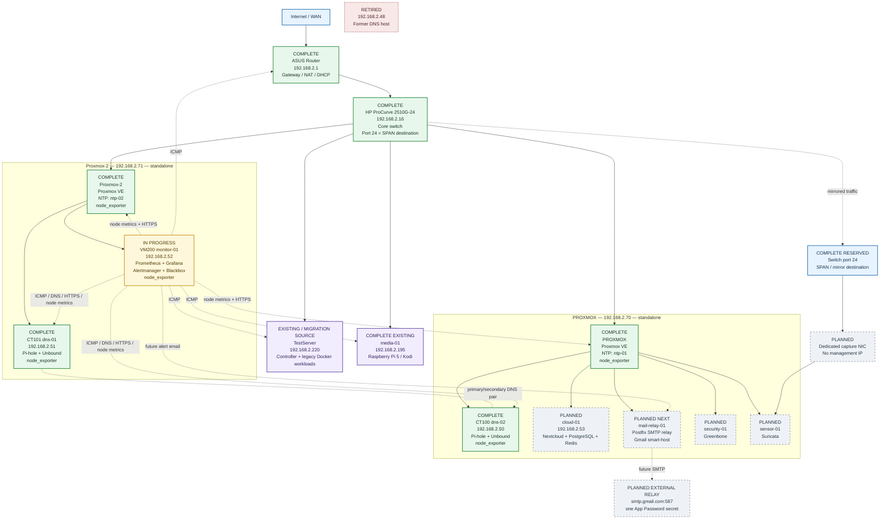

# Homelab Network and Service Layout

**Status:** live build + target-state diagram  
**Updated:** 9 September 2026

This diagram shows both what is **already built** and what is **planned next**.

Legend:

- **COMPLETE** = built, live and validated
- **IN PROGRESS** = deployed but still being extended/validated
- **PLANNED** = approved future service, not yet deployed
- **RETIRED** = no longer part of the active design



## Completed today

| Service / asset | Placement | Address | State |
|---|---|---:|---|
| ASUS router | Physical | `192.168.2.1` | **COMPLETE** — gateway, NAT and DHCP remain here |
| HP ProCurve 2510G-24 | Physical | `192.168.2.16` | **COMPLETE** — core switch; port 24 reserved for SPAN |
| PROXMOX | Physical | `192.168.2.70` | **COMPLETE** — standalone Proxmox host, NTP server, node exporter |
| Proxmox-2 | Physical | `192.168.2.71` | **COMPLETE** — standalone Proxmox host, NTP server, node exporter |
| dns-01 | CT101 on Proxmox-2 | `192.168.2.51` | **COMPLETE** — Pi-hole + Unbound; node exporter |
| dns-02 | CT100 on PROXMOX | `192.168.2.50` | **COMPLETE** — Pi-hole + Unbound; node exporter |
| monitor-01 | VM200 on Proxmox-2 | `192.168.2.52` | **IN PROGRESS** — Prometheus, Grafana, Alertmanager and Blackbox are live; alerting/dashboard work still being added |
| TestServer | Physical | `192.168.2.220` | **EXISTING** — IaC/controller and legacy workloads during migration |
| media-01 | Physical Raspberry Pi 5 | `192.168.2.195` | **EXISTING / LIVE** — Kodi/media |
| Former DNS host | Retired | `192.168.2.48` | **RETIRED** — must not be used as a resolver |

## Planned services

| Service | Planned placement | Address | Purpose |
|---|---|---:|---|
| mail-relay-01 | PROXMOX | **TBD by preflight** | Internal Postfix SMTP relay; only host holding Gmail App Password |
| cloud-01 | PROXMOX | `192.168.2.53` | Nextcloud + PostgreSQL + Redis |
| security-01 | PROXMOX | TBD | Greenbone vulnerability scanning |
| sensor-01 | PROXMOX | TBD | Suricata IDS fed by switch SPAN port 24 |
| Loki / Alloy | monitor-01 | existing `.52` | Central logging after metrics/alerting is stable |

## Current monitoring coverage

The monitoring platform currently has external service probes and host metrics for the core estate.

**Host metrics (node_exporter):**

- `dns-01` — `192.168.2.51:9100`
- `dns-02` — `192.168.2.50:9100`
- `monitor-01` — `192.168.2.52:9100`
- `PROXMOX` — `192.168.2.70:9100`
- `Proxmox-2` — `192.168.2.71:9100`

**Blackbox probes:**

- router ICMP
- both DNS resolvers ICMP + TCP/53
- both Proxmox hosts ICMP + HTTPS/8006
- monitor-01 ICMP
- TestServer ICMP
- media-01 ICMP

Service-specific Pi-hole/Unbound metrics and Chrony/NTP synchronisation metrics are still to be added.

## Mail flow target

The planned alerting/mail path is:

```text
Prometheus
   |
   v
Alertmanager
   |
   v
mail-relay-01
Postfix
   |
   v
smtp.gmail.com:587
   |
   v
Gmail / notification inbox
```

Only `mail-relay-01` will hold the Gmail App Password. Other homelab services will submit mail to the internal relay without needing Gmail credentials.

## Network design notes

- DHCP remains on the ASUS router.
- The active DNS pair is `.51 + .50`.
- `.48` is retired and must not appear in active resolver configuration.
- The two Proxmox hosts remain standalone; there is no active Proxmox cluster.
- Port 24 on the HP ProCurve remains reserved as the Suricata SPAN destination.
- New workloads are built through Git-managed Terraform/OpenTofu + Ansible wherever practical.
