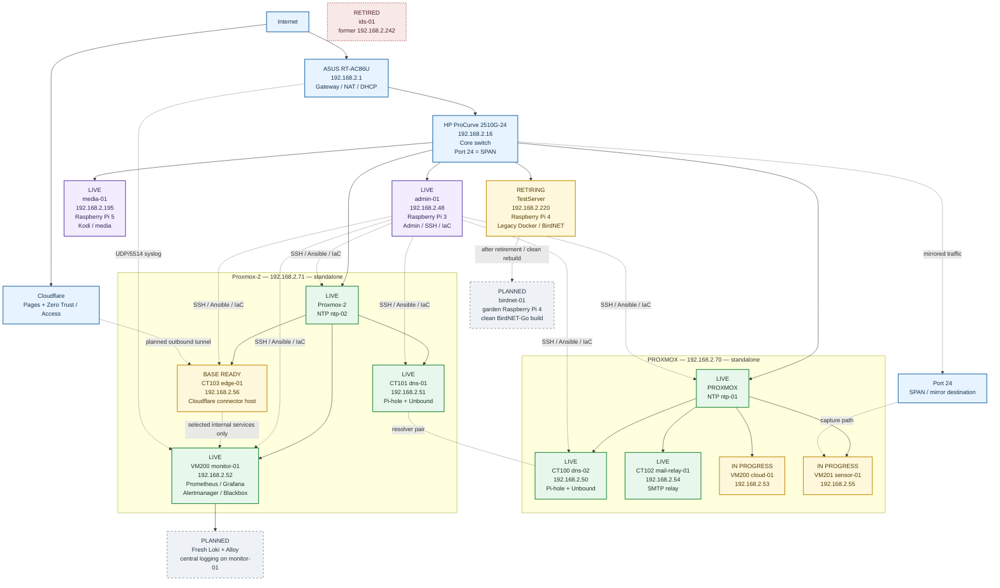

# Homelab Network and Service Layout

**Status:** current estate plus approved next work
**Updated:** 10 September 2026

This document is the text/mermaid counterpart to the network overview image. It deliberately distinguishes **live**, **in progress**, **planned** and **retired** state.



## Current hosting

### PROXMOX (`192.168.2.70`)

| ID | Type | Workload | Address | State |
|---:|---|---|---:|---|
| 100 | LXC | `dns-02` | `192.168.2.50` | Operational |
| 102 | LXC | `mail-relay-01` | `192.168.2.54` | Operational |
| 200 | VM | `cloud-01` | `192.168.2.53` | Running / service work continues |
| 201 | VM | `sensor-01` | `192.168.2.55` | Running / sensor work continues |
| 9000 | VM template | Debian 13 cloud template | — | Stopped |
| 9001 | VM template | Debian 13 cloud template + QGA | — | Stopped |

### Proxmox-2 (`192.168.2.71`)

| ID | Type | Workload | Address | State |
|---:|---|---|---:|---|
| 101 | LXC | `dns-01` | `192.168.2.51` | Operational |
| 103 | LXC | `edge-01` | `192.168.2.56` | Base host operational; cloudflared pending |
| 200 | VM | `monitor-01` | `192.168.2.52` | Operational metrics/alerting; logging pending |

## Physical Raspberry Pi roles

| Host | Address | Hardware | Role |
|---|---:|---|---|
| `admin-01` | `192.168.2.48` | Raspberry Pi 3 | Administration / SSH / Ansible / Git |
| `media-01` | `192.168.2.195` | Raspberry Pi 5 | Kodi/media endpoint |
| `TestServer` | `192.168.2.220` | Raspberry Pi 4 | Legacy migration source; future garden BirdNET-Go rebuild |

## Central logging

Current:

```text
RT-AC86U
  -> UDP/5514
  -> monitor-01 / rsyslog
  -> /var/log/homelab/router/rt-ac86u.log
```

Target:

```text
approved hosts / dedicated logs
  -> Alloy
  -> Loki on monitor-01
  -> Grafana
```

The old TestServer Alloy/Loki configuration is not the desired-state source.

## Cloudflare edge

`edge-01` is ready as an unprivileged Debian 13 LXC on `Proxmox-2`. The remaining work is to install/configure `cloudflared`, create the tunnel, define public hostnames and put Cloudflare Access/MFA in front of selected administrative applications.

No inbound router port-forward is part of this design.

## Outstanding work

See [OUTSTANDING-WORK.md](OUTSTANDING-WORK.md). The current order is:

1. Cloudflare Tunnel + Access on `edge-01`;
2. fresh Loki/Alloy central logging on `monitor-01`;
3. finish TestServer retirement with backup gates satisfied;
4. clean-build the Pi 4 as the garden BirdNET-Go host;
5. finish Proxmox storage/SMART and recovery documentation.
